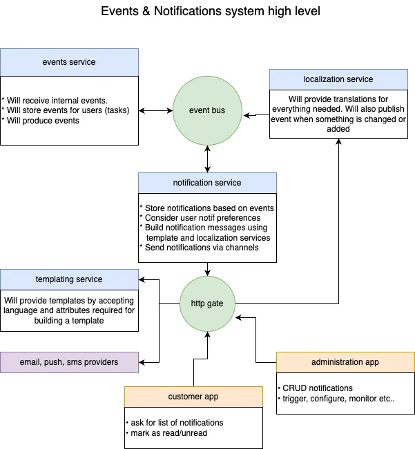
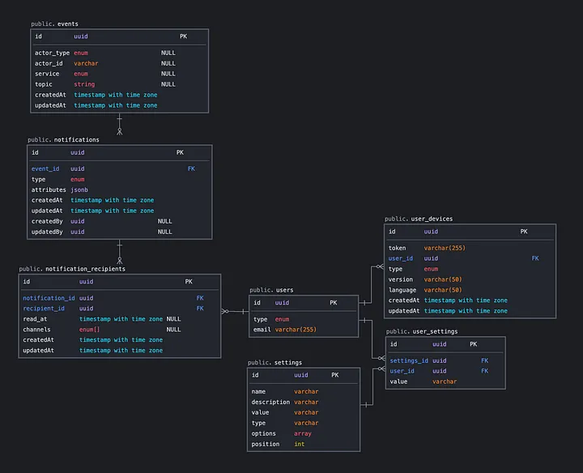

# Notify Service

## Planning the integration

1. Anything that happened in the system from the business point, can trigger notification(s).
2. Notifications to send can be targeted to one or more recipients or a group of recipients.
3. We need to support different channels of notifications: Email, Push for Android/iOS devices, in-app.
4. Notifications should be localized, with means to support different languages and time zones at least.
5. Users should have access to their previous/old notifications (AKA notifications or notification center).
6. Some push or email notifications shouldn’t be recorded/visible in the user’s notification center (such as a marketing alert about a discount, or another short-living alert), and vice versa, some notifications that are visible in the user’s notification center, shouldn’t have produced an alert such as a push notification (or an email have been sent).
7. Users should be able to customize the notifications consumption (frequency, categories, channels ..), for example, set a preferred channel for some type of notifications, or even turn that off.

## System design

## Service Architecture

### Database design

